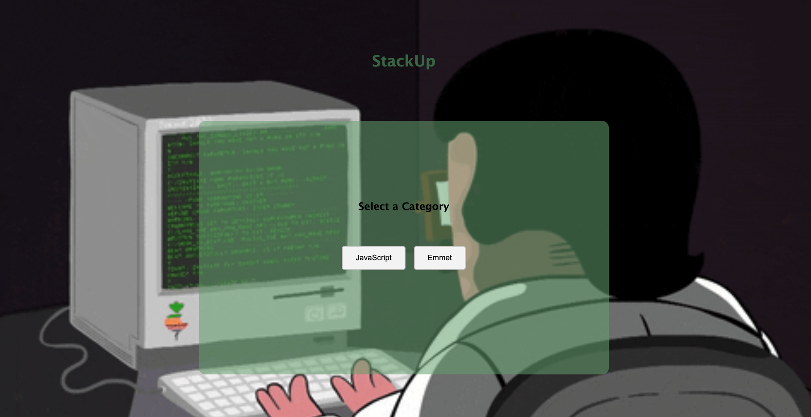

# project-quiz
# StackUp Code QUiz

Link to Quiz Game: [stackUp Game](https://victoriatillero.github.io/project-quiz/)
 

### About the game:
I created a quiz game to help new developers get more comforable with JavaScript and Emmet Abbreviations. The quiz will not provide the correct answer if it is guessed incorrectly to encourage playing again and learning the material. Once the round is complete, you can either play the same category again or a different category. If you score less than 3 correct, you will hear a message that says "better luck next time."

### Instructions:
1. **select category**: For now, it's either javaScript or Emmet, but will later include more languages.
2. **select answer**: Once you've read the question and think you have the answer, click any of the 3 buttons. They will either turn red or green, depending on correctness of answer.
3. **Next button**: Once you've looked over the question and result, you must click the next question button to move onto next question. If you're unsure of a question, you can skip but it will be counted against you.
4. **play again**: Once the quiz is done, you will see your results and can decide whether you'd like to play again either in the same category or a different one.

### Technologies used:
* HTML

* CSS

* JavaScript

## Planned Future Enhancements

* Add more categories (Python,Ruby, etc)

* Use confetti at results screen to indicate a perfect score

* Implement a leaderboard, which includes the name and the time it took the person to complete the quiz. This will allow a user to keep track of their score over time. The leaderboard should get cleared everytime there is an update to the category, so that if new questions are added, the user can quickly know that they haven't completed that portion yet.

### Attributions:

The image of the body was created by GreenPlaceTV on Giphy

The stars displayed in the results section were created by Nintendo for Mario Kart [link to image](https://www.google.com/url?sa=i&url=https%3A%2F%2Fwww.pngall.com%2Fmario-star-png%2F&psig=AOvVaw39VCIEUKCmuD5QLyc-HtFH&ust=1738795807268000&source=images&cd=vfe&opi=89978449&ved=0CBEQjRxqFwoTCOCl3aWNq4sDFQAAAAAdAAAAABAE)

The questions were mostly created by the creator of the game, with some help from google (I didn't save the links as I was finding them, will do moving forward sorry. )
